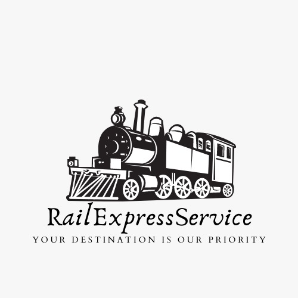

# Rail-Express-Services
Railway Facilities During Journey

# Submission by Team NEXUS for Frost Hack

Totally B2C Model

<h2 align= "left"><b>Our Product</b></h2>

We NEXUS present before you,<b>"Rail-Express Services"</b>.

 &ensp;

## Our Inspirarion
How people across India are facing problems with the catering sanetization, in Indian Railways most of the people traveling in train, avoid to buy the food provided by the IRCTC because of hygiene problem and also the shortage of the variety available in the menu,well not only food but also for the luggages they have to spend so much time to find the Coolie in-order to take there luggages and also when we find one they ask money that dosen’t worth it .There are also some cases when you fall ill during the journey and you cannot do anything as you haven’t got the medicines with you .
Well not any more because we are bringing all this facilities with top class services all at one place .

## How to Run :
1. Simply Clone our Repo and run index.html file (You can use Live Server or no problem)
2. Or You can Simply go to our website, we have provided link of website at the bottom of this README.md file.
 

# WHAT YOU WILL EXPERIECNE ?
Your destination is our Priority with the Excellence

Our website is more of a Indian Railways oriented.We provide catering ,medication,coolie all at one place .We provide you we the top services according to your location .We provide you the best services at best price. Our website is easy to use.

<h2 align= "left"><b>Website in a Print view</b></h2>

  

 &ensp;
 &ensp;
 &ensp;
 &ensp;
 &ensp;
 &ensp;
 &ensp;
 &ensp;
 &ensp;
 &ensp;

## Presentation 
Check the Documentation section for Video and PPT

## Tech Stack

- eJS, CSS, Bootstrap, HTML, SCSS

- Firebase Authentication and Database.

<h2 align= "left"><b>Meet Our Project Maintainers :</b></h2>

   &ensp;
  
  <h2 align= "left"><b>Demo Video and Website Link 👇</b></h2>

- Website Link : <a href="https://rail-express-service.netlify.app/" target="_blank">Welcome to Rail-Express Service</a>
- Youtube Demo : <a href="">Click to watch full video</a>
